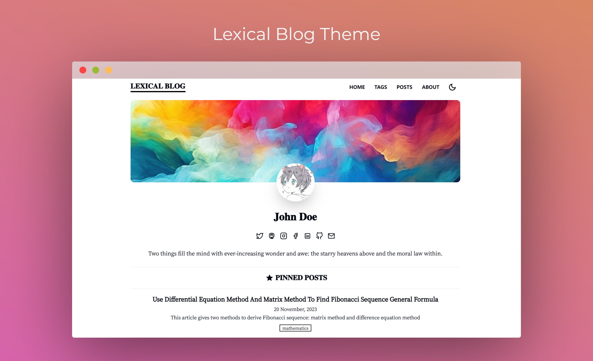
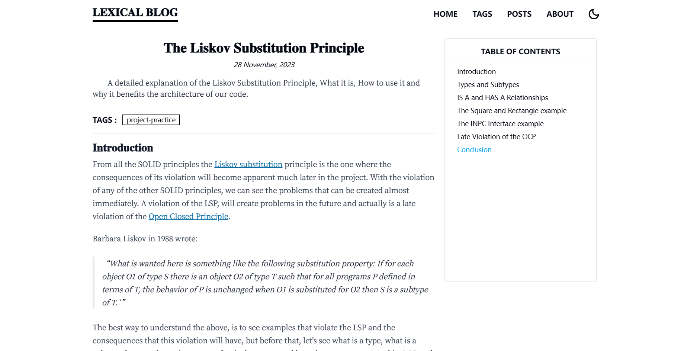
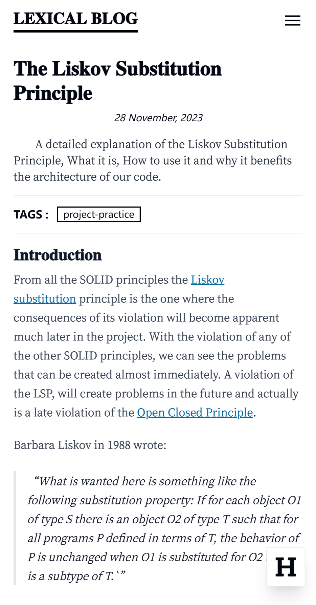

## NEXT.JS LEXICAL BLOG TEMPLATE

[English](./README.MD)

[](https://github.com/PrinOrange/nextjs-lexical-blog)
[](https://github.com/PrinOrange/nextjs-lexical-blog)
[](https://twitter.com/Codemetic)
[](https://blog.terminals.run/sponsor)

[](https://vercel.com/new/clone?repository-url=https%3A%2F%2Fgithub.com%2FPrinOrange%2Fnextjs-lexical-blog&project-name=nextjs-lexical-blog-template&repository-name=nextjs-lexical-blog&demo-title=Lexical%20Blog%20Demo&demo-description=This%20is%20a%20sleek%20and%20efficient%20web%20blog%20project%2C%20built%20with%20Next.js%20%2B%20MDX%20%2B%20TailwindCSS.%20You%20can%20write%20your%20blog%20posts%20in%20Markdown%20and%20easily%20deploy%20them%20on%20Vercel.&demo-url=nextjs-lexical-blog-demo.vercel.app&demo-image=https%3A%2F%2Fraw.githubusercontent.com%2FPrinOrange%2Fnextjs-lexical-blog%2Fmain%2Fdocs%2Fpreview1.png)

---

这是一个设计简洁、高效的网络博客项目。它以 Next.js + MDX + TailwindCSS 构建，你可以使用 Markdown 格式来编写博客文章，并且能很轻松地部署到 Vercel 上。

它具备了博客网站的一切基本功能：标签分类、编写、评论、标题列表等。




它是一个响应式的网站，对市场上大多数不同尺寸的屏幕都有良好的支持。无论是手机、平板电脑、便携小尺寸电脑等，都能在上面轻松阅读网站内容。

| Home Page In Mobile              | Reader Page In Mobile            |
| -------------------------------- | -------------------------------- |
|  |  |

更重要的是，本项目是可以灵活配置的。本项目只编写了博客网站的基础功能，不执著于细节方面，这意味着你可以自己编写自己喜欢的主题。

### 快速上手

着手本项目之前，我在此假设你已经具备以下知识水平：

- 对React.js, Next.js, Node.js 开发和 TypeScript 语言较熟悉。
- 能较为熟练地书写 Markdown 文档、HTML文档。
- 拥有基本的 Web 开发知识，如部署 Web 服务、SSL、反向代理等。

#### 初始化项目

本项目要求的运行环境如下：

- node.js v18+
- npm v9+
- Chromium 系浏览器（Chrome、Edge）或者 Firefox。

我推荐使用 Visual Studio Code 作为开发工具。

执行脚本以安装依赖，

```bash
npm install
```

#### 创建博客

所有的博客文件均用 Markdown 书写，储存在 `/data/posts` 目录下。但是，如果你要创建一篇新博客，**不要直接手动在 `/data/posts` 目录下直接创建 Markdown 文件！** 因为每一篇博客需要携带一些 FrontMatter 头信息，这些应该由程序自动生成，否则可能会在解析时出错。

你应该使用脚本来创建帖子。

```bash
npm run newpost
```

然后程序会问你一些问题，你只需要根据问题输入你的回答，程序会自动为你创建一个新帖子文件并打开它。

```plain text
> lexical-blog@0.1.0 newpost
> node ./scripts/newpost.mjs

? What's the title?
// 必选，在这里输入你的文章标题。建议不超过 20 字。

? What's the subtitle?
// 可选。在这里输入你的文章副标题。建议不超过 20 字。

? Assign tags for the posts and separate them with commas.
// 可选。为文章打上标签，并且用英文逗号来分隔它们。
// 比如technology,news,programming 。
// 建议标签数量不超过 4 个，每个标签不超过 3 个单词或者 5 个汉字。

? Do NOT prompt this post? (D:false) No
// 默认为否。是否要低调发布？
// 如果是，那么这篇文章发布后不会被推送到首页，也不会收录到 RSS 。
// 只能通过文章总列表中找到它。

? Do you want to pin this post? (D:false) No
// 默认为否。是否要置顶这篇文章？

? Do you allow everybody share this post? (D:true) Yes
// 是否允许他人分享这篇文章？如果为否，那么这篇文章会被禁止复制、通过社交链接分享。
```

然后程序就会通知如下信息，这代表着博客文件已经生成，你可以打开并编辑。

```plaintext
Create Post Succeed.
Open the file ./data/posts/2023-12-24-This-is-my-new-post.md to write your blog now.
Some fields, such as summary, need to be filled in by yourself after opening the file.
```

打开刚创建好的帖子文件，你可以看到如下信息：

```plaintext
---
title: "xxxxxxx"
subtitle: "xxxxxxx"
summary: ""
coverURL: ""
time: "2023-12-29"
tags: ["xxx","xxx"]
noPrompt: false
pin: false
allowShare: true
---

```

其中 `title` ，`subtitle` ，`tags` 等等字段在创建时脚本已经自动为你生成好了。只有 `summary` ，`coverURL` 字段还是空的。它们需要你手动填写。

`summary` 字段是对文章的大体总结，会展示到博客列表中，建议 100 字以内。而 `coverURL` 是博客的封面图片，需要写入图片的网络引用链接，会展示到帖子顶部。为了最佳展示效果，建议图片的长宽比为 5 : 2。

#### 开发

在开发环境下执行项目。

```bash
npm run dev
```

当然你可以使用 Turbo Build 来执行开发模式，它在项目热刷新上有良好的性能。

```bash
npm run dev:turbo
```

#### 构建

构建项目，可执行

```bash
npm run build
```

或者使用 Turbo Build 构建项目，以提高性能

```bash
npm run build:turbo
```

### 数据与配置

博客的配置文件在 `./data` 目录下，一共有两种，均用 TypeScript Object 定义。每一项的数据都用注释给出了说明。

- [config.ts](./data/config.ts) ：网站的主要配置信息，如网站标题、社交账号、头像、封面图象等。
- [friends.ts](./data/friends.ts) ：用于存放友情链接。

### 一些问题

#### 字体

经过大量的实践验证，本站使用中文和英文作为主要文字，因此，本项目使用 **方正小标宋（非商业用途）、思源屏显臻宋** 作为字体资源，它们在移动端、PC 端的屏幕上均有不错的显示效果，所以分别作为正式标题和正文的字体。

但是，为了节约带宽资源、提高加载速度，我对这两款字体的字符集做了子集化，裁剪了大量的生僻字符，这两款字体只支持简体中文、常见的特殊符号和英语拉丁字母。所以，如果你的博客中使用了生僻汉字、日本文字、朝鲜文、生僻字符等，可能会无法显示。

当然，你也可以自己在网上下载自己想要的字体，并按照你的要求做字体裁剪。

#### MDX

经过综合考虑，本项目使用了 [next-mdx-remote](https://github.com/hashicorp/next-mdx-remote) 作为 MDX 引擎。但是，考虑到本博客是以记载文字为主，而非文档型网站，且 MDX 语法与 Markdown 语法差异较大，所以本项目支持大众更常用的 Markdown 语法来书写内容。当然，你也可以在 Markdown 中使用 HTML 片段实现更灵活的排版。

#### 图床、外链图片

由于本项目使用 next-mdx-remote 引擎，这个引擎不允许直接在 Markdown 中直接使用项目目录下的图片。所以，如果需要插入图片，应当先将图片上传到图床后在文档中引用图片链接。

我推荐使用 **PicGO** 工具来搭建自己的图床。[你可以点击此处查看文档。](https://picgo.github.io/PicGo-Doc/en/)

#### RSS Feed

本站支持 RSS Feed 2.0，每次构建网站时均自动生成 RSS 链接。每次 RSS Feed 推送的文章与首页的最新文章一致。当然你可可以通过 `./data/config.ts` 中的 `RSSFeed.enabled` 项来选择是否启用。

#### 评论系统

本网站使用 Giscus 作为评论系统。具体配置方法请看这里。它要求每一个评论者都要使用自己的 Github 账号。当然，你也可以使用其他的评论系统，比如 Disqus 。

你可以[点击这里查看 Giscus 的相关介绍和用法。](https://giscus.app/)

#### i18n

对于个人博客，i18n 其实并没有实用意义。所以，本项目暂时 **不支持 i18n** ，如果你是多语言作者，为了用语言来区分博客，我建议在每篇文章的 tags 下加一个当前语言的标志。比如，对中文博客，在 tags 下加一个 `中文博客` 标签，对英文博客，在 tags 下加一个 `English` 标签。

### 部署

#### 部署到 Vercel

如果你的受众不是以中国大陆的用户为主，那么我推荐使用 [Vercel](https://vercel.com) 部署这个博客网站。

点击以下按钮快速部署。

[](https://vercel.com/new/clone?repository-url=https%3A%2F%2Fgithub.com%2FPrinOrange%2Fnextjs-lexical-blog&project-name=nextjs-lexical-blog-template&repository-name=nextjs-lexical-blog&demo-title=Lexical%20Blog%20Demo&demo-description=This%20is%20a%20sleek%20and%20efficient%20web%20blog%20project%2C%20built%20with%20Next.js%20%2B%20MDX%20%2B%20TailwindCSS.%20You%20can%20write%20your%20blog%20posts%20in%20Markdown%20and%20easily%20deploy%20them%20on%20Vercel.&demo-url=nextjs-lexical-blog-demo.vercel.app&demo-image=https%3A%2F%2Fraw.githubusercontent.com%2FPrinOrange%2Fnextjs-lexical-blog%2Fmain%2Fdocs%2Fpreview1.png)

#### 部署到服务器

部署到自己的服务器较为麻烦。我们推荐使用 [PM2.js](https://github.com/Unitech/pm2) 来部署网站，并使用 nginx 等反向代理工具将主机域名映射到本地程序端口上。

另外，你可以使用 Let's Encrypt + Certbot 为网站配置免费的 SSL 证书，[点击这里获得更详细的说明。](https://letsencrypt.org/getting-started/)

### 开源许可

本项目以 [MIT 协议](./LICENSE) 开源。我们欢迎一切具有建设性的意见、代码贡献。

**注意：尽量不要将本项目使用于商业用途。因为本项目引用的第三方图标、字体等部分美术资源要求非商业用途，可能存在法律风险。**
