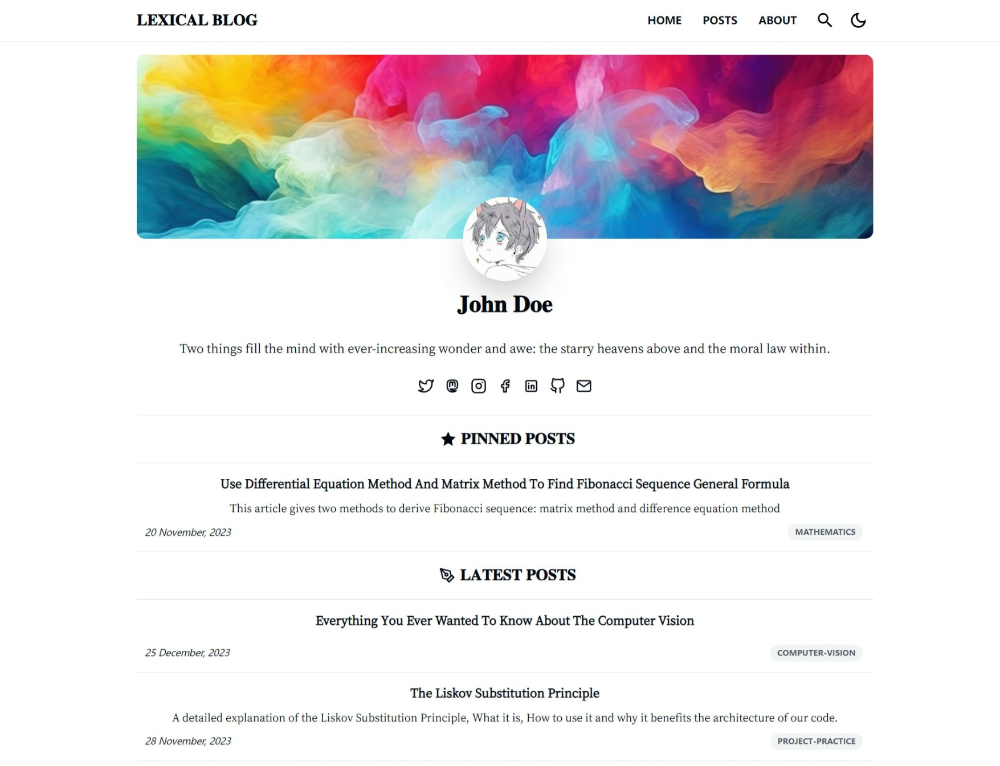
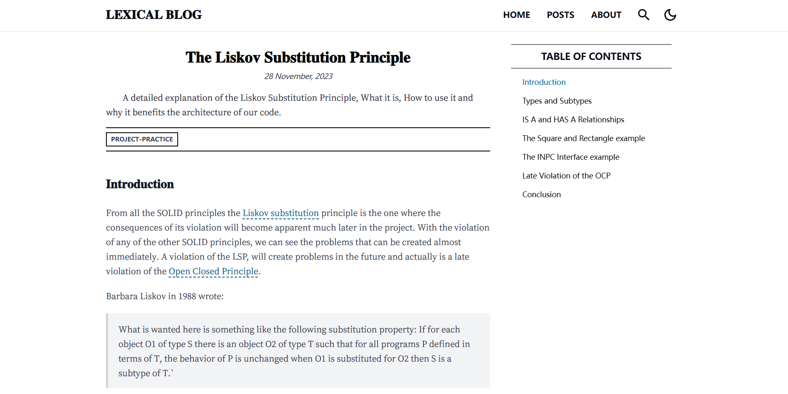
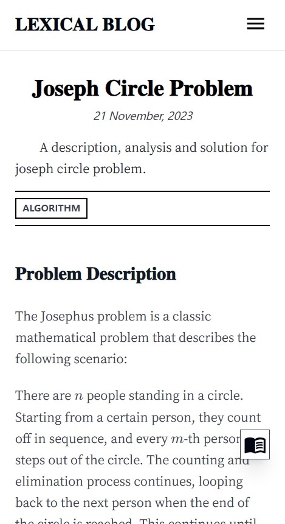

## NEXT.JS LEXICAL

- [简体中文](./README-CN.MD)

[](https://github.com/PrinOrange/nextjs-lexical-blog)
[](https://github.com/PrinOrange/nextjs-lexical-blog)
[](https://twitter.com/Codemetic)
[](https://blog.terminals.run/sponsor)

[](https://vercel.com/new/clone?repository-url=https%3A%2F%2Fgithub.com%2FPrinOrange%2Fnextjs-lexical-blog&project-name=nextjs-lexical-blog-template&repository-name=nextjs-lexical-blog&demo-title=Lexical%20Blog%20Demo&demo-description=This%20is%20a%20sleek%20and%20efficient%20web%20blog%20project%2C%20built%20with%20Next.js%20%2B%20MDX%20%2B%20TailwindCSS.%20You%20can%20write%20your%20blog%20posts%20in%20Markdown%20and%20easily%20deploy%20them%20on%20Vercel.&demo-url=nextjs-lexical-blog-demo.vercel.app&demo-image=https%3A%2F%2Fraw.githubusercontent.com%2FPrinOrange%2Fnextjs-lexical-blog%2Fmain%2Fdocs%2Fpreview1.png)

---

This is a sleek and efficient web blog project, built with Next.js + MDX + TailwindCSS. You can write your blog posts in Markdown and easily deploy them on Vercel.

It has all the basic functions of a blog website: tag classification, writing, comments, title list, etc.




It is a responsive website with good support for most different screen sizes available in the market. Whether it is a mobile phone, tablet, portable small-sized computer, etc., you can easily read website content on it.

| Home Page In Mobile              | Reader Page In Mobile            |
| -------------------------------- | -------------------------------- |
|  |  |

More importantly, this project can be flexibly configured. This project only writes the basic functions of the blog website and is not obsessed with the details, which means that you can write the theme you like.

### Quick Start

Before diving into this project, I assume you already have the following knowledge:

- Familiarity with React.js, Next.js, Node.js development, and proficiency in TypeScript.
- Ability to write Markdown documents and HTML documents proficiently.
- Basic knowledge of web development, including deploying web services, SSL, reverse proxy, etc.

#### Initialize Project

The required runtime environment for this project is as follows:

- Node.js v18+
- npm v9+
- Chromium-based browser (Chrome, Edge) or Firefox.

I recommend using Visual Studio Code as the development tool.

Execute the following script to install dependencies:

```bash
npm install
```

#### Creating a Blog Post

All blog files should be written in Markdown and stored in the `/data/posts` directory. However, if you want to create a new blog post, **do not directly create a Markdown file in the `/data/posts` directory manually!** This is because each blog post needs to carry some FrontMatter header information, which should be auto-generated by the program, otherwise, it might cause parsing errors.

You should use a script to create the post.

```bash
npm run newpost
```

Then, the program will ask you a series of questions. Simply input your answers according to the prompts, and the program will automatically create a new post file for you and open it.

```plain text
> lexical-blog@0.1.0 newpost
> node ./scripts/newpost.mjs

? What's the title?
// Required. Enter the title of your article here.
// Recommended no more than 15 words.

? What's the subtitle?
// Optional. Enter the subtitle of your article here.
// Recommended no more than 15 words.

? Assign tags for the posts and separate them with commas.
// Optional. Tag your article and separate the tags with commas.
// E.g., technology,news,programming
// It is recommended that the number of tags should not exceed 4,
// and each tag should be no more than 2 words.

? Do NOT prompt this post? (D:false) No
// Default is no. Do you want to publish this post discreetly?
// If yes, then the article won't be pushed to the homepage or included in RSS after publishing,
// and can only be found in the complete article list.

? Do you want to pin this post? (D:false) No
// Default is no. Do you want to pin this article?

? Do you allow everybody to share this post? (D:true) Yes
// Do you allow others to share this article? If no, then copying and sharing via social links will be disabled for this article.
```

Afterward, the program will display the following message, indicating that the blog file has been created, and you can open and edit it.

```plaintext
Create Post Succeed.
Open the file ./data/posts/2023-12-24-This-is-my-new-post.md to write your blog now.
Some fields, such as summary, need to be filled in by yourself after opening the file.
```

Open the post file you just created and you can see the following content:

```plaintext
---
title: "xxxxxxx"
subtitle: "xxxxxxx"
summary: ""
coverURL: ""
time: "2023-12-29"
tags: ["xxx","xxx"]
noPrompt: false
pin: false
allowShare: true
---

```

The existing `title`, `subtitle`, `tags` and other fields are automatically generated for you by the script when you create them. Only `summary` and `coverURL` fields are still empty. They require you to fill them in manually.

The `summary` field is a general summary of the article, which will be displayed in the blog list. It is recommended to be within 50 words. And `coverURL` is the cover image of the blog. The network reference link of the image needs to be written, which will be displayed at the top of the post. For optimal presentation, the recommended image aspect ratio is 5:2.

#### Development

Run the project in development mode.

```bash
npm run dev
```

Alternatively, you can use Turbo Build for development mode, which has good performance for hot reloading.

```bash
npm run dev:turbo
```

#### Build

Build the project by running:

```bash
npm run build
```

Or use Turbo Build for building the project to enhance performance:

```bash
npm run build:turbo
```

### Data and Configuration

The blog's configuration files are located in the `./data` directory, and there are two types, both defined using TypeScript objects. Comments are provided to explain each item's data.

- [config.ts](./data/config.ts): Main configuration information for the website, such as the website title, social accounts, avatar, cover images, etc.
- [friends.ts](./data/friends.ts): Used to store friend links.

### FAQ

#### Fonts

After extensive practical testing, this site primarily uses Chinese and English texts. Therefore, this project employs **Fangzheng Xiaobiaosong (for non-commercial use) and Source Han Serif Screen** as font resources. They display well on both mobile and PC screens, hence are used respectively for official titles and main text.

However, to save bandwidth and improve loading speed, I've subset these two fonts, cutting out a large number of rare characters. These fonts only support Simplified Chinese, common special symbols, and English Latin letters. Therefore, if your blog uses rare Chinese characters, Japanese characters, Korean text, or other rare characters, they might not display correctly.

Of course, you can also download your preferred fonts from the internet and customize them according to your requirements.

#### MDX

After careful consideration, this project has adopted [next-mdx-remote](https://github.com/hashicorp/next-mdx-remote) as the MDX engine. However, considering that this blog is primarily focused on recording text, rather than serving as a documentation-type website, and given the significant differences between MDX and Markdown syntax, this project supports the more commonly used Markdown syntax for content creation. Of course, you can also incorporate HTML snippets within Markdown for more flexible layout options.

#### Image Hosting, External Image Links

Due to the use of the `next-mdx-remote` engine in this project, it doesn't allow direct usage of images located in the project directory within Markdown. Therefore, when inserting images, it's recommended to upload them to an image hosting service and then reference the image URLs in the document.

I recommend using **PicGO** tool to set up your own image hosting. [You can click here to view the documentation.](https://picgo.github.io/PicGo-Doc/en/)

#### RSS Feed

This site supports RSS Feed 2.0 and automatically generates an RSS link with each website build. The articles pushed in the RSS Feed are consistent with the latest articles on the homepage. Of course, you can choose whether to enable it or not through the `RSSFeed.enabled` option in `./data/config.ts`.

#### Comment System

This website utilizes Giscus as the comment system. For specific configuration instructions, please refer to this [link](https://giscus.app/). It requires each commenter to use their own GitHub account. Of course, you can also opt for other comment systems like Disqus.

You can [click here to view the relevant information and usage of Giscus](https://giscus.app/).

#### i18n

For personal blogs, i18n (internationalization) doesn't really serve a practical purpose. Therefore, this project does not support i18n at the moment. If you are a multilingual author and want to distinguish your blogs by language, I suggest adding a tag for the current language in the tags of each article. For instance, if you are a bilingual speaker of Spanish and English, you could add an `español` tag under the tags for each Spanish article, and an `English` tag for the English blogs.

### Deployment

#### Deploying to Vercel

I recommend deploying this blog website using [Vercel](https://vercel.com). It's popular for being free and powerful.

Click the button below for a quick deployment.

[](https://vercel.com/new/clone?repository-url=https%3A%2F%2Fgithub.com%2FPrinOrange%2Fnextjs-lexical-blog&project-name=nextjs-lexical-blog-template&repository-name=nextjs-lexical-blog&demo-title=Lexical%20Blog%20Demo&demo-description=This%20is%20a%20sleek%20and%20efficient%20web%20blog%20project%2C%20built%20with%20Next.js%20%2B%20MDX%20%2B%20TailwindCSS.%20You%20can%20write%20your%20blog%20posts%20in%20Markdown%20and%20easily%20deploy%20them%20on%20Vercel.&demo-url=nextjs-lexical-blog-demo.vercel.app&demo-image=https%3A%2F%2Fraw.githubusercontent.com%2FPrinOrange%2Fnextjs-lexical-blog%2Fmain%2Fdocs%2Fpreview1.png)

#### Deploying to a Server

Deploying to your own server can be a bit more complex. We recommend using [PM2.js](https://github.com/Unitech/pm2) to deploy the website and using reverse proxy tools like Nginx to map the host domain to the local program port.

Additionally, you can use Let's Encrypt + Certbot to configure a free SSL certificate for the website. [Click here for more detailed instructions.](https://letsencrypt.org/getting-started/)

### Open Source License

This project is open source under the [MIT License](./LICENSE). We welcome any constructive feedback and code contributions.

**Note: Please avoid using this project for commercial purposes whenever possible. Some artistic resources, such as third-party icons and fonts referenced in this project, are intended for non-commercial use and may pose legal risks if used commercially.**
